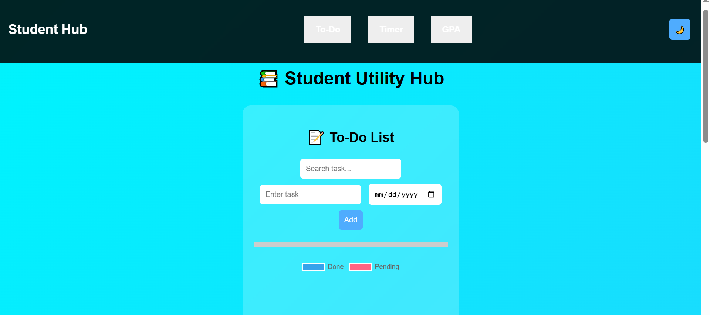
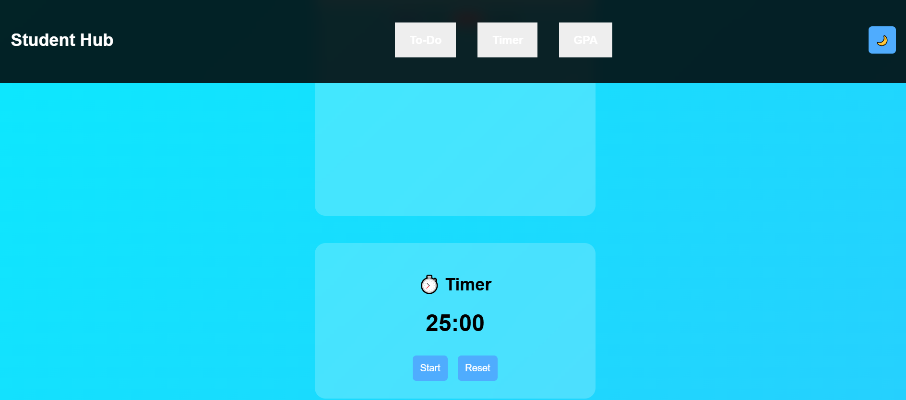
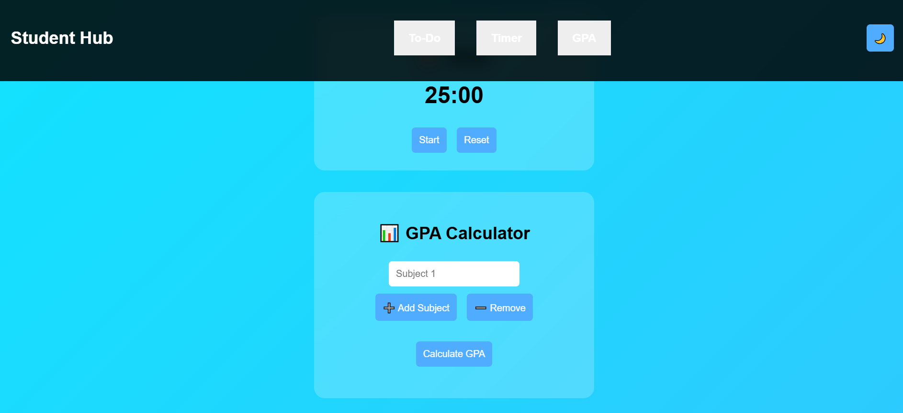

# Student-Hub
# 📚 Student Utility Hub

A modern and interactive web application designed to help students manage their daily tasks, track study sessions, and calculate GPA — all in one place.

---

## 🚀 Live Demo
🔗 https://harinivelu45.github.io/Student-Hub/

---

## ✨ Features

### 📝 To-Do List
- Add, delete, and mark tasks as completed
- Due date support with overdue highlight
- Search functionality
- Progress tracking bar
- Visual chart (Completed vs Pending tasks)

### ⏱️ Study Timer
- 25-minute Pomodoro timer
- Start & Reset functionality
- Sound alert when time is up

### 📊 GPA Calculator
- Add unlimited subjects dynamically
- Automatic GPA calculation
- Displays average marks

### 🌙 UI & Experience
- Dark mode toggle
- Glassmorphism UI design
- Smooth animations & hover effects
- Toast notifications
- Fully responsive (mobile-friendly)

---

## 🛠️ Technologies Used

- HTML5
- CSS3 (Glassmorphism, Animations)
- JavaScript (Vanilla JS)
- Chart.js (for data visualization)
- LocalStorage (data persistence)

---

## 📂 Project Structure
Student-Hub/
│── index.html
│── style.css
│── script.js

---
## 📸 Screenshots

### 📝 To-Do

### ⏱️ Timer

### 📊 GPA

----

## 💡 Future Improvements

- User authentication (Login/Signup)
- Cloud sync using Firebase
- Push notifications
- Progressive Web App (PWA)
- AI-based task suggestions

---

## 👩‍💻 Author

**Harini Velmurugan**

---

## ⭐ Show your support

If you like this project, give it a ⭐ on GitHub!
